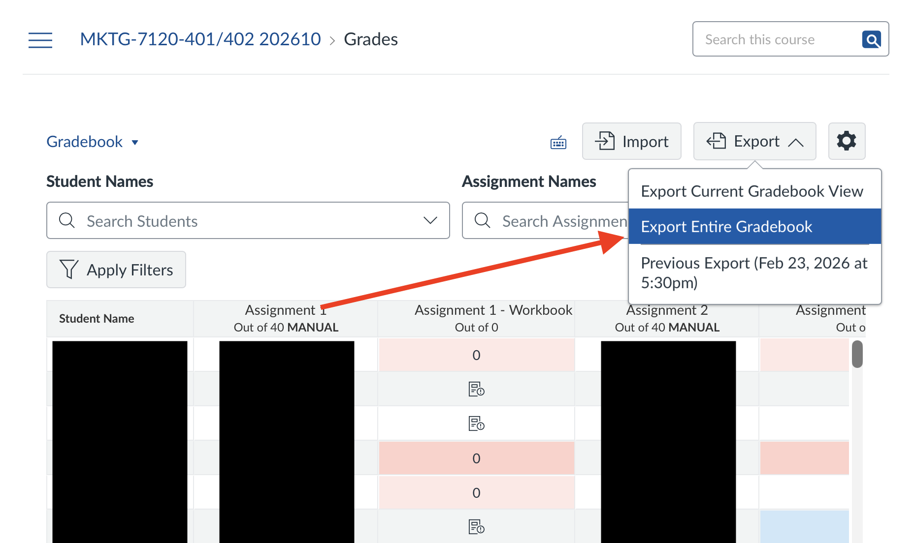
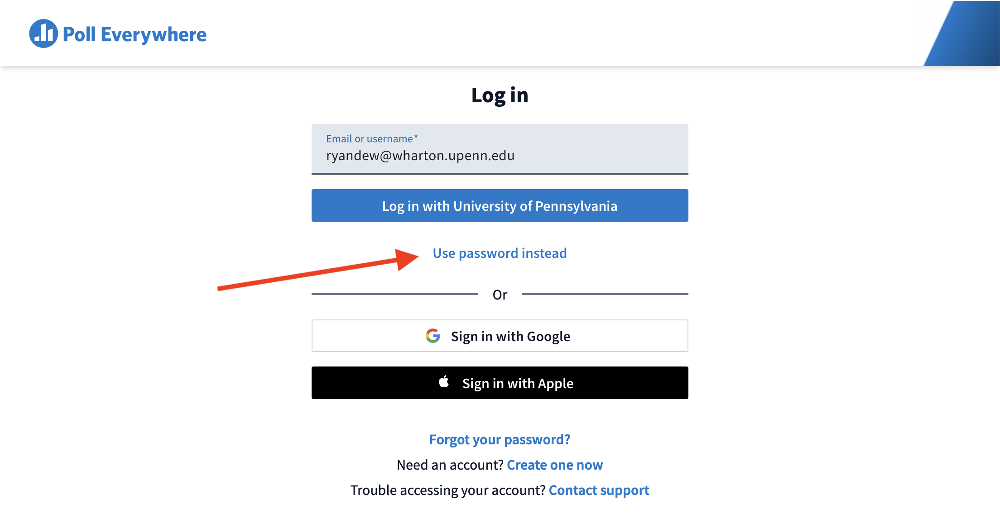

# PollEv Grader

## Overview

This R script automates grading for Poll Everywhere participation by matching PennKeys from a exported PollEv CSV against a Canvas gradebook CSV.

## What the Script Does

-   Finds the Canvas CSV file in the working directory to `canvas.csv`
-   Finds and renames the PollEv CSV file to `pe[date].csv`
-   Cleans PollEv response data
-   Extracts PennKeys from the PollEv file
-   Matches PollEv PennKeys against Canvas SIS Login IDs
-   Assigns participation grades
-   Exports a new graded Canvas CSV file `graded[date].csv`

## Required Files

Place the following files in the working directory:

-   Canvas gradebook export CSV
-   Poll Everywhere report CSV
-   This R script

## Usage

1.  Export the Gradebook CSV file from Canvas and place it in the working directory.

    

2.  Go to polleverywhere.com and log in to Ryan's account (note that you need to select "Use password instead", otherwise the website might do something weird). 

3.  
